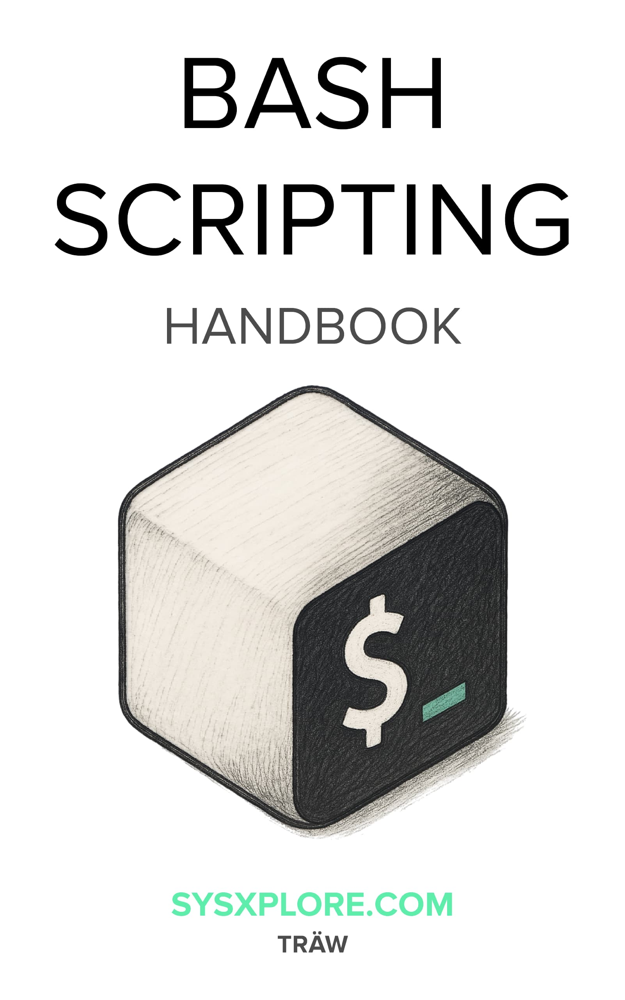
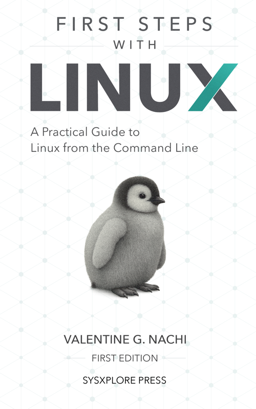

<table>
  <tr>
    <td width="34%" valign="top" align="center">
      
    </td>
    <td width="66%" valign="middle">
      <h1>
        Bash Scripting<br />
        <span style="color:#61f2b0;">Handbook</span>
      </h1>
      <p>
        A clear, example-based reference for learning and writing Bash scripts.
        Focus on the commands and concepts you'll actually use when working in the shell.
      </p>
      <br />
      <table>
        <tr>
          <td>
            <code>~/bash-handbook</code>
            <pre><code>$ echo "If you must do it more than once, automate it!"</code></pre>
          </td>
        </tr>
      </table>
    </td>
  </tr>
</table>

This project is a practical Bash handbook focused on the commands, patterns, and shell concepts you'll actually use. It starts with the basics, then builds toward more advanced scripting techniques with concise explanations and real examples you can try in your terminal.

## New to Linux?

If you are still getting comfortable with the terminal, filesystems, permissions, and everyday Linux workflows, start with _First Steps with Linux_ before diving deep into Bash scripting.

<table>
  <tr>
    <td width="28%" valign="top" align="center">
      <a href="https://firststepswithlinux.com">
        
      </a>
    </td>
    <td width="72%" valign="middle">
      <h3>Start with First Steps with Linux</h3>
      <p>
        A beginner-friendly introduction to using Linux with confidence.
        It is the best starting point if you want a gentler path into the shell before moving into Bash scripting and automation.
      </p>
      <p>
        <a href="https://firststepswithlinux.com">Visit firststepswithlinux.com</a>


## What You'll Learn

The book walks through core Bash fundamentals and then expands into more advanced scripting topics. Along the way, you'll learn how to:

- Work with variables, arrays, loops, and conditional logic
- Write reusable Bash functions and understand shell scope
- Use quoting, redirection, pipelines, and exit codes correctly
- Chain commands and capture output with substitution techniques
- Apply parameter expansion for string manipulation
- Debug scripts and understand shell behavior more confidently
- Use regular expressions, globbing, and process substitution in real workflows

The emphasis throughout the handbook is clarity, practicality, and example-driven learning.

## Chapters

### Chapter 1: Getting Started

Learn Bash fundamentals and environment setup.

### Chapter 2: Built-in Commands

Master essential Bash built-in commands.

### Chapter 3: Arrays

Work with indexed and associative arrays.

### Chapter 4: Conditions and Flow

Implement conditional statements and logic.

### Chapter 5: Loops

Create efficient `for`, `while`, and `until` loops.

### Chapter 6: Functions

Build reusable functions and understand scope.

### Chapter 7: Arithmetic Operations

Perform mathematical calculations in Bash.

### Chapter 8: Parameter Expansion

Master string manipulation and shell transformations.

### Chapter 9: Command-line Chaining

Chain commands with operators and pipes.

### Chapter 10: Command Substitution

Capture and use command output effectively.

### Chapter 11: Process Substitution

Redirect the output or input of commands to appear as files using `<()` and `>()`.

### Chapter 12: Bitwise Operators

Work with bitwise operations and binary values.

### Chapter 13: Quoting

Master quoting rules and special characters.

### Chapter 14: Globbing

Use pattern matching and wildcards effectively.

### Chapter 15: Pipelines and Redirections

Handle input and output streams with confidence.

### Chapter 16: Exit Status Codes

Understand exit codes and error handling.

### Chapter 17: History

Work with command history and expansion.

### Chapter 18: Options

Configure Bash options and shell behavior.

### Chapter 19: Regular Expressions

Master pattern matching with regex syntax.

### Chapter A: Appendix

Quick reference, cheat sheets, and additional resources.

## How to Use This Book

You do not need to read the handbook from start to finish in order. You can jump between chapters, copy examples, test commands as you go, and come back to topics whenever something needs a second pass.

It is designed to work both as:

- A beginner-friendly path into Bash scripting
- A quick reference for day-to-day shell work
- A practical companion while writing or debugging scripts

## Project Structure

The book content and assets are organized for AsciiDoc-based publishing:

- `book/chapters`: chapter source files
- `book/images`: images used throughout the book
- `book/themes`: theme and styling assets
- `build/`: generated output such as PDF artifacts

## Build

This repository uses an AsciiDoc-based workflow for building the handbook into publishable formats such as PDF.

To generate the PDF locally:

```sh
./create-book-pdf.sh
```

The generated file is written as `bash-scripting-handbook.pdf`.

If you are working on the content, edit the source files in `book/` and then rebuild to review the final output.

## Open Source

This project is open source under the MIT License.

- License: [LICENSE](./LICENSE)
- Contributing guide: [CONTRIBUTING.md](./CONTRIBUTING.md)
- Code of conduct: [CODE_OF_CONDUCT.md](./CODE_OF_CONDUCT.md)

## Purpose

The goal of this handbook is simple: make Bash easier to learn, easier to reference, and easier to use well. Whether you are automating repetitive tasks, writing shell scripts for development workflows, or just trying to understand what is happening in the terminal, this handbook is meant to be a practical guide you can keep coming back to.

      </p>
    </td>
  </tr>
</table>
